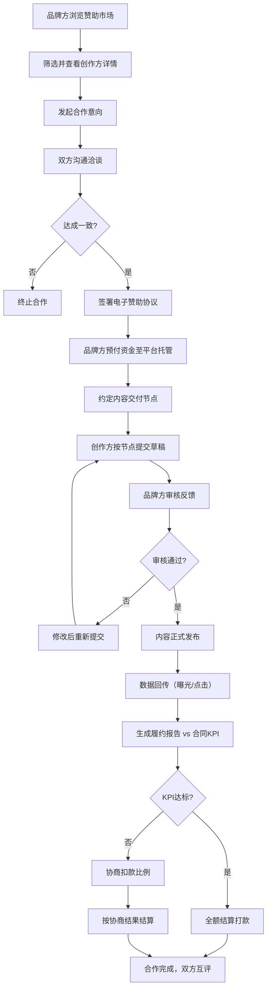

## 1. 产品概述

企业赞助与商务合作管理平台是连接内容创作方/活动主办方与品牌方的B2B协作平台，解决赞助对接效率低、沟通记录分散、履约缺乏数据支撑、结款纠纷多等行业痛点。
- 为创作方提供标准化赞助招募发布、受众数据展示、内容交付管理、履约收款一站式服务
- 为品牌方提供高效资源搜索、合作全流程管控、数据化KPI考核、资金安全保障能力
- 市场价值：打通赞助合作全链路，降低交易成本，提升行业透明度与信任度

## 2. 核心功能

### 2.1 用户角色
| 角色 | 注册方式 | 核心权限 |
|------|----------|----------|
| 创作方 | 邮箱/手机号注册，资质认证 | 发布赞助招募页、管理受众数据、响应合作意向、提交内容审核、查看履约报告、申请结款 |
| 品牌方 | 邮箱/手机号注册，企业认证 | 浏览赞助市场、发起合作意向、沟通确认细节、签署协议、审核内容、确认数据、KPI考核、资金托管 |
| 平台管理员 | 后台账号 | 审核用户资质、处理争议仲裁、监控平台交易、系统配置 |

### 2.2 功能模块
1. **赞助市场首页**：导航栏、搜索筛选区、推荐创作方、热门赞助资源、平台数据展示
2. **赞助招募详情页**：创作方主页、受众数据分析、赞助资源套餐、合作案例、意向发起
3. **创作方工作台**：招募页管理、合作订单管理、内容交付中心、财务中心、数据中心
4. **品牌方工作台**：合作管理、内容审核中心、KPI履约看板、资金管理、供应商库
5. **合作沟通中心**：意向洽谈、合同协商、修改意见反馈、实时消息、历史记录
6. **合同与交付管理**：电子合同签署、交付节点配置、里程碑提醒、版本管理
7. **履约报告中心**：数据回传、KPI对比、完成度分析、异常预警、报告导出
8. **资金托管结算**：预付款托管、节点打款、KPI扣款协商、发票管理、流水查询

### 2.3 页面详情
| 页面名称 | 模块名称 | 功能描述 |
|----------|----------|----------|
| 赞助市场首页 | 搜索筛选区 | 按粉丝量级、平台类型、行业领域、报价区间筛选创作方 |
| 赞助市场首页 | 推荐卡片 | 展示创作方头像、名称、平台、粉丝数、核心标签、起投价 |
| 赞助市场首页 | 平台数据 | 展示累计成交额、成功合作数、覆盖创作者数、品牌方数量 |
| 赞助招募详情页 | 受众画像 | 性别比例、年龄分布、地域分布热力图、兴趣标签云 |
| 赞助招募详情页 | 数据表现 | 平均播放量、完播率、互动率、粉丝增长趋势图 |
| 赞助招募详情页 | 赞助套餐 | 口播/贴片/联名/定制等资源类型、规格说明、报价、交付周期 |
| 赞助招募详情页 | 合作案例 | 历史合作品牌、案例作品、效果数据回顾 |
| 创作方工作台 | 招募管理 | 创建/编辑/上下架赞助招募页，预览发布效果 |
| 创作方工作台 | 订单管理 | 合作意向列表、状态流转（待响应/洽谈中/已签约/执行中/已完成） |
| 创作方工作台 | 内容交付 | 按节点提交草稿、查看修改意见、版本对比、最终确认 |
| 品牌方工作台 | 合作看板 | 进行中项目进度条、待办提醒、预算使用情况 |
| 品牌方工作台 | 内容审核 | 查看内容、批注反馈、通过/驳回操作、审核历史 |
| 合作沟通中心 | 会话列表 | 按合作项目分组的消息列表，未读提醒 |
| 合作沟通中心 | 对话界面 | 富文本消息、文件传输、@提醒、重要消息标记 |
| 合同管理 | 合同模板 | 标准赞助合同模板、自定义条款、历史版本 |
| 合同管理 | 签署流程 | 双方在线签署、电子签章、签署状态追踪 |
| 履约报告中心 | 数据看板 | 曝光量、点击量、转化率等核心指标实时展示 |
| 履约报告中心 | KPI对比 | 合同约定指标 vs 实际达成数据，完成百分比 |
| 资金托管中心 | 资金账户 | 余额、冻结金额、待结算、流水明细 |
| 资金托管中心 | 结算流程 | 申请结算、KPI扣款协商、最终打款、发票上传 |

## 3. 核心流程

品牌方从浏览赞助市场开始，筛选合适创作方后发起合作意向，双方沟通确认后签署赞助协议并约定交付节点。执行阶段创作方按节点提交内容，品牌方审核反馈，内容发布后数据回传生成履约报告，最终根据KPI完成情况进行资金结算。

## 4. 用户界面设计

### 4.1 设计风格
- **主色调**：深邃商务蓝（#1E3A5F）作为品牌主色，传达专业与信任；辅以金色（#C9A961）作为高端商务点缀色
- **辅助色**：成功绿（#10B981）用于审核通过/KPI达标，警示橙（#F59E0B）用于待处理/扣款预警，危险红（#EF4444）用于异常/驳回
- **按钮风格**：圆角8px的胶囊型按钮，主按钮采用深蓝渐变+微妙内阴影，悬停时轻微上浮+发光效果
- **字体**：标题使用「思源宋体」展示商务质感，正文使用「思源黑体」保障可读性；数字使用等宽字体「JetBrains Mono」
- **布局风格**：卡片式布局配合清晰的视觉层级，数据仪表盘采用网格化Bento布局，侧边栏+内容区经典双栏结构
- **图标风格**：线性图标搭配统一2px描边，关键状态图标使用面性图标强化识别度

### 4.2 页面设计概述
| 页面名称 | 模块名称 | UI元素 |
|----------|----------|--------|
| 赞助市场首页 | Hero区 | 深蓝渐变背景+金色装饰线条，大标题使用思源宋体粗体，搜索框采用玻璃拟态效果，入场时有渐显上浮动画 |
| 赞助市场首页 | 筛选栏 | 水平Tab切换平台类型，标签式筛选条件，选中项带蓝色底部下划线+背景高亮 |
| 赞助市场首页 | 创作者卡片 | 白色卡片+柔和阴影，头像圆形金边，关键数据色块突出，悬停时卡片上浮12°轻微旋转+金色边框高亮 |
| 赞助招募详情页 | 受众画像 | 性别用环形进度条、年龄用横向柱状图、地域用彩色热力地图，数据加载时骨架屏动效 |
| 赞助招募详情页 | 赞助套餐 | 三栏卡片对比布局，推荐套餐带金色「HOT」角标和放大动效，价格数字用大号等宽字体 |
| 工作台侧边栏 | 导航菜单 | 深色侧边栏，选中项蓝色左侧指示条+图标高亮，支持折叠展开，折叠态仅显示图标 |
| 工作台数据看板 | Bento网格 | 数据卡片大小不一错落排布，关键指标卡带渐变背景，数字滚动计数入场动画 |
| 合作沟通中心 | 对话界面 | 气泡式消息布局，创作方消息靠左浅灰底，品牌方消息靠右深蓝底，系统消息居中金色细线分隔 |
| 合同签署页 | 合同预览 | 仿纸质文档纹理+阴影，签署区虚线框+手写签名板，签署时笔触动画 |
| 履约报告中心 | KPI仪表盘 | 半环形进度图+百分比数字，不同完成度对应不同颜色渐变，低于阈值时数字闪烁警示 |
| 资金托管中心 | 流水列表 | 斑马纹行背景，金额数值右对齐，入账绿色向上箭头、出账红色向下箭头，时间轴左侧细线 |

### 4.3 响应式设计
- **设计策略**：桌面端优先（1440px基准），适配平板（1024px）和移动端（375px）
- **断点设置**：≥1280px大屏完整布局、768-1279px平板侧边栏可折叠、<768px移动端底部导航+卡片堆叠
- **触摸优化**：移动端按钮最小高度48px，卡片间距加大，支持左右滑动切换Tab，下拉刷新数据列表

### 4.4 视觉动效
- **页面加载**：内容区从下向上渐显平移，骨架屏脉冲闪烁，数据数字滚动到目标值
- **交互动效**：卡片悬停0.3s ease-out上浮+阴影加深，按钮点击scale(0.97)回弹，模态框背景模糊渐显
- **状态切换**：合作状态变更时标签色带滑入动画，审核通过时绿色对勾绘制动画，消息发送气泡弹出弹性动效
- **数据可视化**：图表加载时柱状图从底部生长、环形图描边动画、热力图颜色逐层叠加
