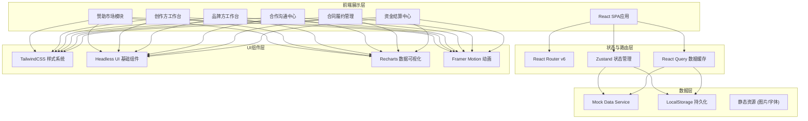
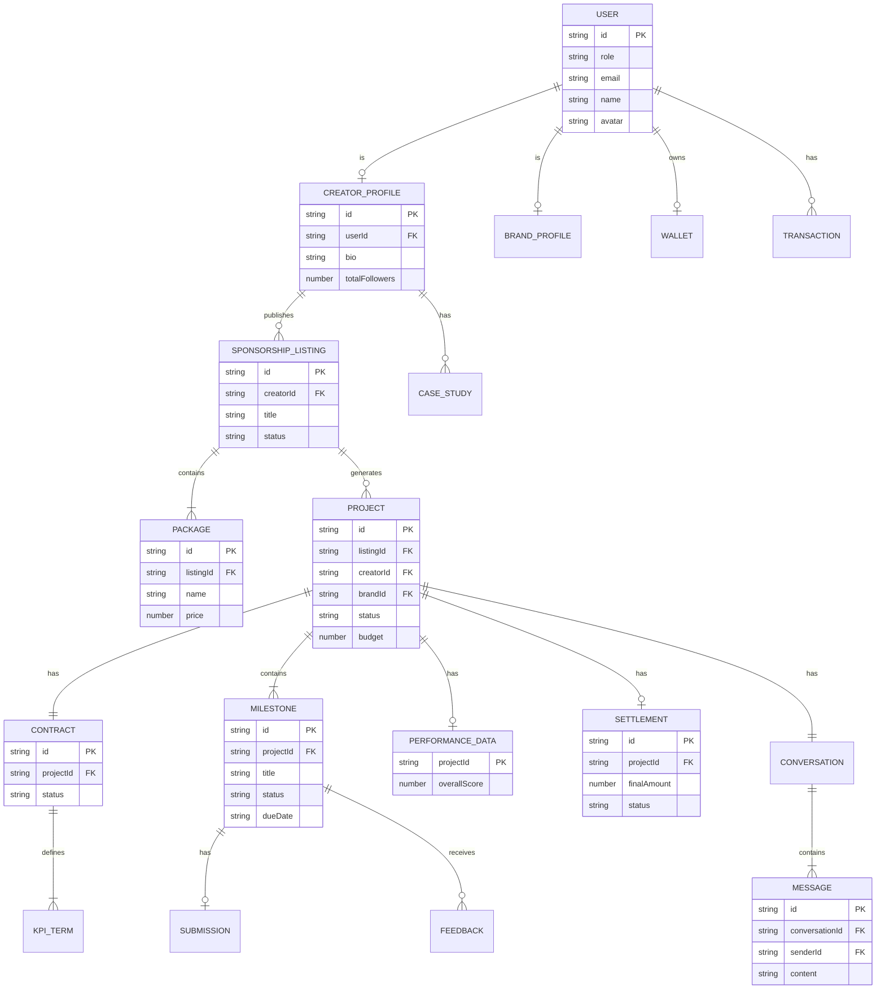

## 1. 架构设计



## 2. 技术描述

- **前端框架**：React@18.2 + TypeScript@5
- **构建工具**：Vite@5（快速冷启动、HMR热更新）
- **样式方案**：TailwindCSS@3.4 + CSS变量主题系统
- **状态管理**：Zustand@4（轻量、简洁、支持中间件）
- **数据请求**：TanStack Query (React Query)@5 + Axios
- **路由方案**：React Router v6（嵌套路由、懒加载）
- **UI组件**：Headless UI（无样式可访问组件）+ Lucide React 图标库
- **数据可视化**：Recharts@2（React生态图表库）
- **动画方案**：Framer Motion@11（声明式动画、手势交互）
- **表单处理**：React Hook Form@7 + Zod 校验
- **富文本**：轻量自定义Markdown渲染组件
- **后端**：无后端，使用Mock Service模拟API，数据持久化到LocalStorage

## 3. 路由定义

| 路由 | 页面/组件 | 权限角色 | 功能说明 |
|------|-----------|----------|----------|
| `/` | 赞助市场首页 | 公开 | 创作方列表、搜索筛选、平台数据展示 |
| `/creator/:id` | 赞助招募详情页 | 公开 | 创作方主页、受众数据、赞助套餐、合作案例 |
| `/login` | 登录页 | 公开 | 角色选择登录 |
| `/dashboard` | 工作台根布局 | 登录用户 | 侧边导航、用户信息、消息通知 |
| `/dashboard/creator/listings` | 招募页管理 | 创作方 | 创建/编辑/上下架赞助招募页 |
| `/dashboard/creator/listings/new` | 新建招募页 | 创作方 | 表单向导式创建赞助招募 |
| `/dashboard/creator/orders` | 合作订单管理 | 创作方 | 意向响应、订单状态、合作详情 |
| `/dashboard/creator/deliverables` | 内容交付中心 | 创作方 | 按节点提交、修改记录、版本管理 |
| `/dashboard/creator/finance` | 财务中心 | 创作方 | 账户余额、结算申请、流水明细 |
| `/dashboard/brand/projects` | 合作项目看板 | 品牌方 | 进行中项目、进度追踪、待办提醒 |
| `/dashboard/brand/review` | 内容审核中心 | 品牌方 | 草稿查看、批注反馈、审核决策 |
| `/dashboard/brand/performance` | KPI履约看板 | 品牌方 | 数据回传、KPI对比、履约报告 |
| `/dashboard/brand/funds` | 资金管理 | 品牌方 | 资金托管、预付款、结算审批 |
| `/chat` | 合作沟通中心 | 登录用户 | 会话列表、实时消息、文件共享 |
| `/chat/:projectId` | 项目对话详情 | 参与用户 | 指定合作项目的沟通界面 |
| `/contract/:projectId` | 合同签署页 | 参与用户 | 合同预览、电子签署、节点约定 |

## 4. API接口定义（Mock层）

```typescript
// 用户与认证
interface LoginRequest {
  role: 'creator' | 'brand';
  email: string;
  password: string;
}
interface User {
  id: string;
  role: 'creator' | 'brand' | 'admin';
  name: string;
  avatar: string;
  company?: string;
  verified: boolean;
}

// 创作方与招募页
interface CreatorProfile {
  id: string;
  userId: string;
  name: string;
  avatar: string;
  platforms: Platform[];
  totalFollowers: number;
  categories: string[];
  bio: string;
  location: string;
  audienceData: AudienceData;
  pastCases: CaseStudy[];
}
interface Platform { type: string; handle: string; followers: number; avgViews: number; }
interface AudienceData {
  genderRatio: { male: number; female: number; other: number };
  ageDistribution: { range: string; percentage: number }[];
  geoDistribution: { region: string; percentage: number }[];
  interests: { tag: string; score: number }[];
}
interface SponsorshipListing {
  id: string;
  creatorId: string;
  title: string;
  description: string;
  coverImage: string;
  packages: Package[];
  status: 'draft' | 'published' | 'archived';
  createdAt: string;
}
interface Package {
  id: string;
  name: string;
  type: 'mention' | 'overlay' | 'collab' | 'custom';
  description: string;
  deliverables: string[];
  price: number;
  deliveryDays: number;
  recommended?: boolean;
}

// 合作项目
interface Project {
  id: string;
  listingId: string;
  creatorId: string;
  brandId: string;
  packageId: string;
  status: 'pending' | 'negotiating' | 'signed' | 'executing' | 'delivered' | 'completed' | 'cancelled';
  title: string;
  budget: number;
  brief: string;
  milestones: Milestone[];
  contract?: Contract;
  performance?: PerformanceData;
  createdAt: string;
  updatedAt: string;
}
interface Milestone {
  id: string;
  title: string;
  description: string;
  dueDate: string;
  status: 'pending' | 'in_progress' | 'submitted' | 'approved' | 'rejected';
  submission?: Submission;
  feedback?: Feedback[];
}
interface Submission {
  id: string;
  content: string;
  attachments: string[];
  version: number;
  submittedAt: string;
}
interface Feedback {
  id: string;
  authorId: string;
  content: string;
  createdAt: string;
  resolved: boolean;
}

// 合同与KPI
interface Contract {
  id: string;
  projectId: string;
  content: string;
  kpiTerms: KpiTerm[];
  creatorSignedAt?: string;
  brandSignedAt?: string;
  status: 'draft' | 'pending_signature' | 'signed' | 'terminated';
}
interface KpiTerm {
  id: string;
  metric: string;
  targetValue: number;
  unit: string;
  weight: number;
}

// 履约数据
interface PerformanceData {
  projectId: string;
  metrics: { metric: string; actual: number; target: number; unit: string }[];
  overallScore: number;
  dataSources: string[];
  reportGeneratedAt: string;
}

// 资金
interface Wallet {
  userId: string;
  balance: number;
  frozen: number;
  pending: number;
  currency: string;
}
interface Transaction {
  id: string;
  type: 'deposit' | 'hold' | 'release' | 'refund' | 'deduction';
  amount: number;
  projectId?: string;
  description: string;
  status: 'pending' | 'completed' | 'failed';
  createdAt: string;
}
interface Settlement {
  id: string;
  projectId: string;
  totalAmount: number;
  deductionAmount: number;
  finalAmount: number;
  deductionReason: string;
  status: 'pending_negotiation' | 'agreed' | 'paid';
  createdAt: string;
}

// 消息沟通
interface Conversation {
  id: string;
  projectId: string;
  participants: string[];
  lastMessage?: Message;
  unreadCount: number;
}
interface Message {
  id: string;
  conversationId: string;
  senderId: string;
  content: string;
  type: 'text' | 'file' | 'system';
  attachments?: string[];
  createdAt: string;
  readBy: string[];
}
```

## 5. 数据模型（Mock Schema）



## 6. 前端项目结构

```
src/
├── assets/              # 静态资源（图片、字体）
├── components/          # 通用可复用组件
│   ├── ui/              # 基础UI（Button、Card、Modal、Input等）
│   ├── layout/          # 布局组件（Sidebar、Navbar、DashboardLayout等）
│   ├── charts/          # 图表组件（AudienceChart、KpiGauge等）
│   └── business/        # 业务组件（CreatorCard、PackageCard等）
├── pages/               # 路由页面组件
│   ├── marketplace/     # 赞助市场相关页面
│   ├── dashboard/       # 工作台相关页面
│   │   ├── creator/     # 创作方子页面
│   │   └── brand/       # 品牌方子页面
│   ├── chat/            # 沟通中心页面
│   ├── contract/        # 合同签署页面
│   └── auth/            # 登录注册页面
├── store/               # Zustand状态管理
│   ├── authStore.ts
│   ├── projectStore.ts
│   └── uiStore.ts
├── services/            # API服务层（Mock实现）
│   ├── mockData.ts      # 模拟数据
│   ├── creatorService.ts
│   ├── projectService.ts
│   ├── contractService.ts
│   └── paymentService.ts
├── hooks/               # 自定义React Hooks
├── utils/               # 工具函数（格式化、校验等）
├── types/               # TypeScript类型定义
├── router/              # 路由配置
├── styles/              # 全局样式与主题
└── App.tsx              # 应用根组件
```
